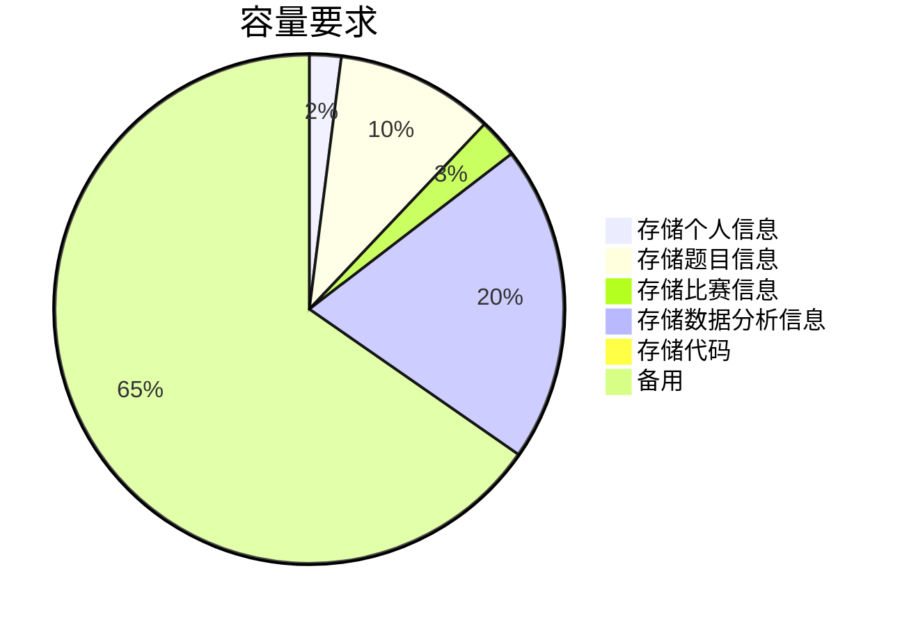

[TOC]

# BrainStorm知识竞赛系统

## 1 版本历史

| 日期     | 版本 | 人员   | 更新内容                                                     |
| -------- | ---- | ------ | ------------------------------------------------------------ |
| 22.03.13 | v0.0 | 赵子涵 | 创建文档及目录; 编写前言和项目概述. |
| 22.03.20 | v0.1 | 张瑞轩 | 编写界面需求外非功能性需求 |
| 22.03.22 | v0.2 | 李昀泽 | 编写功能性需求-题库管理功能 |
| 22.03.22 | v0.3 | 刘硕 | 编写功能性需求-用户信息管理功能 |
| 22.03.22 | v0.4 | 刘东泽 | 编写管理端界面需求 |
| 22.03.22 | v0.5 | 刘昀鑫 | 编写功能性需求-自主组卷练习功能, 比赛功能和答题功能. 删除了所有功能性需求中下属的界面条目 |
| 22.03.22 | v0.5.1 | 李昀泽 | 增加界面设计中用户信息界面设计 |
| 22.03.22 | v0.6 | 黄辰麟 | 编写用户端界面需求 |
| 22.03.24 | v1.0 | 赵子涵 | 校验及整合 |
| 22.03.24 | v1.1 | 李昀泽 | 修改功能性需求-题库管理功能，删除了管理员自定tag的权限，删除题库中题目描述属性，添加题目答案属性 |
| 22.03.27 | v1.2 | 张瑞轩 | 去除了部分对于管理员用处不大的属性 |

## 2 前言

### 2.1 编写目的

根据课程组的总体要求, 和小组的相关讨论, 我们编写本需求规格书.

本规格书明确"BrainStorm知识竞赛系统"的产品需求, 描述其功能模块和框架, 面向用户群体的特征, 和开发中的非功能性需求. 撰写本文旨在明确项目需求, 合理安排项目规划与进度, 有效组织软件开发与测试, 该文档也提供了结项时的验收依据.

本文档面向的读者为软件工程课程组老师和助教(客户), 项目管理人员, 设计人员, 开发人员和测试人员, 以及项目使用文档的编写者.

### 2.2 范围

本文档内容包括:
1) 对项目背景, 目标, 设计约束等基本信息进行概述;
2) 按功能性需求, 非功能性需求分别对需求进行分析.

### 2.3 参考文档

1) 需求规格说明书(示例), 北航软工课程组.

## 3 项目概述

### 3.1 项目背景

知识的重要性不言而喻. 人类几千年的历史虽创造出极其丰富的物质基础, 但各种科学/哲学提炼出的知识才是推动发展的核心因素. 无论是出于欣赏或功利, 知识总是被大众广泛喜爱的, 拥有知识的人更是如此. 人们总是喜欢把事物排个名次, 决个高低, 拥有知识的人也不例外.

古代有科举, 现代有考试. 受利于科技发展, 试卷和考场已经不必要了, 一个线上的知识竞赛系统就可以满足相当多的需求. 然而, 虽然当前存在很多公开的知识竞赛软件, 但其包含的题目通常已经被创建者固定, 而难以应用于诸如兴趣社团这样有一定规模但又不具有软件开发能力的中小群体. 因此, 我们计划开发BrainStorm知识竞赛系统, 除知识竞赛的基本功能外, 提供题库管理和比赛创建功能, 来满足上述群体的需要. 

### 3.2 项目目标

BrainStorm的目标是搭建一个知识竞赛系统, 为中小用户群体的题目定制和比赛需求提供支持.

一个目标应用场景是: 学校内有很多社团, 每个社团都可以向本系统添加题目, 开放比赛. 学校里的同学可以自己练习, 以及参加比赛提升rating. rating可以作为学生的某种课外活动量化指标.

系统预计支持以下功能: 基本的用户登录登出信息修改功能, 题库批量添加及管理功能, 用户可定制自主练习功能, 管理员的自定义比赛创建和用户的比赛参与功能.

### 3.4 总体框架

```sequence
participant 超级管理员 as spmg
participant 管理员 as mg
participant 题库及后台 as tk
participant 用户 as us
mg->tk: 管理题目
note right of mg: 题库管理功能
spmg->mg: 管理
mg->us: 管理
note right of mg: 用户管理功能
tk->us: 随机抽题练习
note left of us: 自主练习功能
mg->tk: 选题创建比赛并发布
tk->us: 参加比赛
note left of tk: 比赛创建及参与功能
```

<div>			<!--块级封装-->
    <center>	<!--将图片和文字居中-->
    图 3.4 总体框架说明图	<!--标题-->
    </center>
</div>

### 3.5 用户特点

#### 3.5.1 使用人员

##### 3.5.1.1 用户

| 信息     | 情况                                |
| -------- | ----------------------------------- |
| 用户身份 | 知识竞赛参与者                      |
| 用户动机 | 学习知识, 参与比赛.                 |
| 典型场景 | 在用户端练习, 并参加社团组织的比赛. |
| 预计占比 | 90%                                 |

##### 3.5.1.2 管理员

| 信息     | 情况                                |
| -------- | ----------------------------------- |
| 用户身份 | 知识竞赛组织者                      |
| 教育水平 | 初中及以上                          |
| 技术专长 | 有一定管理及计算机知识              |
| 用户动机 | 为所在团体组织知识竞赛              |
| 典型场景 | 在社团活动后, 添加新的题目创建比赛. |
| 预计占比 | 9%                                  |

#### 3.5.2 维护人员

| 信息     | 情况                                                         |
| -------- | ------------------------------------------------------------ |
| 用户身份 | 超级管理员                                                   |
| 教育水平 | 大学本科                                                     |
| 技术专长 | 熟悉网站管理和维护                                           |
| 典型场景 | 查看网站日访问情况, 处理服务器故障, 应用高权限管理题库和普通管理员 |
| 预计占比 | 1%                                                           |

### 3.6 设计约束

#### 3.6.1 平台约束和经费限制

本项目建设过程中, 软件工程课程组提供了华为软开云对服务器部署进行支持, 无其他经费预算.

#### 3.6.2 开发期限

需要在2022年5月6日之前发布项目测试版, 2022年6月3日之前发布稳定版.

#### 3.6.3 实现语言

项目后端主要使用Python实现, 前端主要使用JavaScript实现.

## 4 功能性需求

### 4.1 用户信息管理功能

#### 4.1.1 业务流程

<div>			<!--块级封装-->
    <center>	<!--将图片和文字居中-->
    
    <br>		<!--换行-->
    图 4.1.1 信息管理流程图，分管理员（左）和普通用户（右）	<!--标题-->
    </center>
</div>


#### 4.1.2 用例图

<div>			<!--块级封装-->
    <center>	<!--将图片和文字居中-->
    
    <br>		<!--换行-->
    图 4.1.2 信息管理用例图	<!--标题-->
    </center>
</div>

#### 4.1.3 功能点

##### 4.1.3.1 业务定义/功能描述

本模块为用户信息管理模块，用来管理业务信息和行为，主要包含以下几个业务：

**1）创建、删除管理员账号功能：**
由超级管理员创建管理员账号并设定初始密码，管理员可自行修改个人密码。超级管理员可以删除管理员账号，但不能删除自己的账号。

**2）账号登录功能：**
管理员通过个人用户名及密码登录，提供找回密码功能，联系超级管理员重置密码。用户通过微信授权登录。

**3）信息展示功能：**
两类管理员均可看到所有用户、管理员的信息，用户可以看到自己的个人信息。

**4）个人信息修改功能：**
管理员可以修改个人信息和账号密码，修改密码时需要验证当前密码，超级管理员可以帮助管理员进行密码重置。

##### 4.1.3.2 使用角色描述

| 使用者     | 使用功能                                                     | 权限     |
| ---------- | ------------------------------------------------------------ | -------- |
| 用户       | 可以查看个人信息 | 权限低   |
| 管理员     | 查看所有用户、管理员的信息，修改自己的信息  | 权限中等 |
| 超级管理员     | 创建、删除管理员账号，查看所有用户、管理员的信息，修改自己的信息，帮助管理员重置密码  | 权限高 |

##### 4.1.3.3 业务操作流程

正常业务如图4.1.1所示，异常操作有：
1）	管理员忘记密码，可以联系超级管理员重置密码。

##### 4.1.3.4 输入

| 功能子模块     | 数据名称                                                     | 格式     |
| ---------- | ------------------------------------------------------------ | -------- |
| 管理员修改信息模块     | 用户名、密码、邮箱、联系电话 | 字符串   |

##### 4.1.3.5 输出

| 功能子模块     | 输出内容                                                    |
| ---------- | ------------------------------------------------------------ |
| 创建管理员账号模块     | 创建成功，创建失败 |
| 删除管理员账号模块     | 删除成功，删除失败 |
| 修改个人信息模块       | 信息修改成功，信息修改失败 |
| 个人信息展示模块       | 个人信息 |

##### 4.1.3.6 约束

超级管理员具有超级权限，可以重置密码，查看全部用户及管理员信息，但是不能查看涉及隐私内容，例如密码。

### 4.2 题库管理功能

#### 4.2.1 业务流程

<div>			<!--块级封装-->
    <center>	<!--将图片和文字居中-->
    
    <br>		<!--换行-->
    图4.2.1  业务流程图	<!--标题-->
    </center>
</div>

#### 4.2.2 用例图

<div>			<!--块级封装-->
    <center>	<!--将图片和文字居中-->
    
    <br>		<!--换行-->
    图4.2.2 题库管理用例图	<!--标题-->
    </center>
</div>

#### 4.2.3 功能点

##### 4.2.3.1业务定义/功能描述

本模块为题库管理模块，用于管理题库，主要包括如下几个业务：

**1）	题目添加功能：**
管理员和超级管理员可以将题目添加到题库中，填写题目名称、题目答案、选定题目标签（tag）并选择是否公开本题即可完成添加。仅超级管理员有权限添加、编辑或删除tag标签库中标签，管理员仅可从已有标签库中选定。题目添加者需自己保证题目叙述的准确性和无二义性。

**2）	题目筛选功能：**
管理员和超级管理员可以依据题目编号、题目名称、题目标签、是否公开中任一或多个属性对题目进行筛选。

**3）	题目查看功能：**
管理员和超级管理员可以查看当前题库中所有题目的所有信息。

**4）	题目编辑功能：**
超级管理员有权限编辑当前题库中所有题目的所有属性（题目编号除外），管理员仅有权限编辑题库中自己添加题目的所有属性（题目编号除外）。

**5）	题目删除功能：**
超级管理员有权限删除当前题库中的所有题目，管理员只有权限删除题库中自己添加的题目。

##### 4.2.3.2 使用角色描述

| 使用者     | 使用功能                                                     | 权限     |
| ---------- | ------------------------------------------------------------ | -------- |
| 超级管理员 | 题目添加，题目筛选，题目查看，自创题目编辑，非自创题目编辑，自创题目删除，非自创题目删除 | 权限高   |
| 管理员     | 题目添加，题目筛选，题目查看，自创题目编辑，自创题目删除     | 权限中等 |

##### 4.2.3.3 业务操作流程

正确操作流程如图4.2.1所示，异常操作流程：

1）题目添加/编辑者填写不符合格式的题目信息，给出提示，并给出正确的格式规范

2）管理员编辑/删除其他用户添加的题目，给出提示，没有该权限

##### 4.2.3.4 输入

| 子功能模块   | 数据名称               | 数据格式   |
| ------------ | ----------------------| ------------|
| 题目添加模块 | 题目名称                |字符串       |
| 题目添加模块 | 题目答案                |字符串       |
| 题目添加模块 | 题目标签                |字符串       |
| 题目添加模块 | 是否公开                |布尔型       |
| 题目筛选模块 | 题目编号                |字符串       |
| 题目筛选模块 | 题目名称                |字符串       |
| 题目筛选模块 | 题目标签                |字符串       |
| 题目筛选模块 | 是否公开                |布尔型       |
| 题目查看模块 | 无需输入，直接查看即可   |
| 题目编辑模块 | 题目名称                |字符串       |
| 题目编辑模块 | 题目答案                |字符串       |
| 题目编辑模块 | 题目标签                |字符串       |
| 题目编辑模块 | 是否公开                |布尔型       |
| 题目删除模块 | 无需输入，直接删除即可     |

##### 4.2.3.5 输出

| 子功能模块   | 输出内容               |
| ------------ | ---------------------- |
| 题目添加模块 | 添加成功、添加失败     |
| 题目筛选模块 | 满足筛选条件的所有题目 |
| 题目查看模块 | 当前题库内所有题目     |
| 题目编辑模块 | 编辑成功、编辑失败     |
| 题目删除模块 | 删除成功、删除失败     |

### 4.3 自主组卷练习功能

#### 4.3.1 业务流程

<div>			<!--块级封装-->
    <center>	<!--将图片和文字居中-->
    
    <br>		<!--换行-->
    图 4.3.1 自主组卷练习流程图	<!--标题-->
    </cente r>
</div>


#### 4.3.2 用例图

<div>			<!--块级封装-->
    <center>	<!--将图片和文字居中-->
    
    <br>		<!--换行-->
    图 4.3.2 自主组卷练习用例图	<!--标题-->
    </center>
</div>


#### 4.3.3 功能点

##### 4.3.3.1 业务定义/功能描述

本模块为用户自主组卷模块，用来自主组卷练习，然后转入答题功能，主要包含以下几个业务：

**1） 选择题库随机组卷功能：**
由用户选择标签与数量，后由系统随机抽题组卷。

##### 4.3.3.2 使用角色描述

| 使用者 | 使用功能         |
| ------ | ---------------- |
| 用户   | 系统自动抽题组卷 |

##### 4.3.3.3 业务操作流程

正常业务如图4.3.1所示

##### 4.3.3.4 输入

| 功能子模块   | 数据名称   | 格式                               |
| ------------ | ---------- | ---------------------------------- |
| 用户选择模块 | 标签，数量 | 图形化界面选择后转为内部形式化数据 |

##### 4.3.3.5 输出

| 功能子模块   | 输出内容                   |
| ------------ | -------------------------- |
| 用户选择模块 | 组卷成功开始答题，组卷失败 |

### 4.4 比赛功能

#### 4.4.1 业务流程

<div>			<!--块级封装-->
    <center>	<!--将图片和文字居中-->
    
    <br>		<!--换行-->
    图 4.4.1.1 用户比赛流程图	<!--标题-->
    </cente r>
</div>


<div>			<!--块级封装-->
    <center>	<!--将图片和文字居中-->
    
    <br>		<!--换行-->
    图 4.4.1.2 管理员比赛流程图	<!--标题-->
    </cente r>
</div>


#### 4.4.2 用例图

<div>			<!--块级封装-->
    <center>	<!--将图片和文字居中-->
    
    <br>		<!--换行-->
    图 4.4.2 比赛用例图	<!--标题-->
    </center>
</div>


#### 4.4.3 功能点

##### 4.4.3.1 业务定义/功能描述

本模块为比赛模块，用来创建与参加比赛，然后转入答题功能，主要包含以下几个业务：

**1） 创建比赛功能：**
由管理员选择比赛开始时间、答题时间、题目、是否为私密比赛属性以创建比赛。

**2） 参赛审批功能：**

对于私密比赛由系统校验密码是否正确以核准用户能否参加私密比赛

**3） 参赛申请功能：**

用户报名参加比赛，若为私密比赛则需要提供参赛密码提交系统自动审批

**4） 查看排名与答题情况功能：**

比赛结束后，管理员可以查看比赛的排名和用户答题情况，错误分布等，用户自己可以查看比赛的排名与自己的答题情况

##### 4.4.3.2 使用角色描述

| 使用者       | 使用功能           |
| ------------ | ------------------ |
| 用户         | 参赛申请           |
| 管理员       | 创建比赛           |
| 管理员       | 参赛审批           |
| 管理员，用户 | 查看排名与答题情况 |


##### 4.4.3.3 业务操作流程

正常业务如图4.4.1.1与4.1.1.2所示

##### 4.4.3.4 输入

| 功能子模块           | 数据名称           | 格式                         |
| -------------------- | ------------------ | ---------------------------- |
| 设定比赛时间模块     | 开始时间、答题时间 | 图形化界面选择后转为整性数据 |
| 设定比赛私密属性模块 | 是否为私密比赛     | 图形化界面选择后转为布尔型   |
| 比赛申请模块         | 参赛密码（可选）   | 字符串                       |

##### 4.4.3.5 输出

| 功能子模块 | 输出内容           |
| ---------- | ------------------ |
| 创建比赛模块  | 创建成功，创建失败 |
| 比赛申请模块            | 申请成功，申请失败              |

### 4.5 答题功能

#### 4.5.1 业务流程

<div>			<!--块级封装-->
    <center>	<!--将图片和文字居中-->
    
    <br>		<!--换行-->
    图 4.5.1 答题流程图	<!--标题-->
    </center>
</div>


#### 4.5.2 用例图

<div>			<!--块级封装-->
    <center>	<!--将图片和文字居中-->
    
    <br>		<!--换行-->
    图 4.5.2 答题用例图	<!--标题-->
    </center>
</div>


#### 4.5.3 功能点

##### 4.5.3.1 业务定义/功能描述

本模块为用户答题模块，入口为自组卷或比赛功能，由用户答题提交服务器检查，主要包含以下几个业务：

**1） 答题功能：**
由用户答题，并由服务器判题，若为限定时间题目，则在时间到达后自动结束作答。

##### 4.5.3.2 使用角色描述

| 使用者 | 使用功能 |
| ------ | -------- |
| 用户   | 答题     |

##### 4.5.3.3 业务操作流程

正常业务如图4.5.1所示

##### 4.5.3.4 输入

| 功能子模块 | 数据名称   | 格式                               |
| ---------- | ---------- | ---------------------------------- |
| 答题模块   | 用户的选择 | 图形化界面选择后转为内部形式化数据 |

##### 4.5.3.5 输出

| 功能子模块 | 输出内容                                                     |
| ---------- | ------------------------------------------------------------ |
| 答题模块   | 正确，错误，未作答（即时反馈情况）；无返回（非即时反馈比赛） |

## 5 非功能性需求

### 5.1 界面需求

#### 5.1.1 管理端界面

管理端界面为知识竞赛组织者对竞赛题目管理的网页端界面，整体采用vue3来进行编写。网页前端共包含个界面：1.登录界面；2.个人信息界面（首次登录界面）；3.管理员管理界面

##### 5.1.1.1登录界面

登录界面主要为管理员以及超级管理员提供登录的入口，此处在设计中主要分为两栏：在左栏放置项目Logo，在右侧放置用户名和密码的输入框以及对应的文案提示

##### 5.1.1.2个人信息界面（首次登录界面）

此处界面主要为首次登录的管理员和超级管理员而提供的，主要目的是满足管理员和超级管理员在第一次登录时进行个人身份的填写以及密码的修改，而且此界面包含的其它功能会一直存在并且可以正常调用。具体实现方式如下：

1.此处界面分为上栏和下栏，上栏用来填写管理员和超级管理员的用户名、联系电话和邮箱

2.下栏用来实现修改密码的功能，界面由旧密码确认框、新密码输入框、确认密码输入框、确认修改按钮及其上述界面对应文案组成

##### 5.1.1.3管理员管理界面

此管理页面被分为四个部分，分别为：1.顶栏；2.侧栏；3.中栏；4.底栏

###### 5.1.1.3.1顶栏设计

此处主要放置项目Logo、账户登出按钮和个人中心按钮，其中个人中心按钮可以查看并修改个人信息并对该账户的密码进行修改

###### 5.1.1.3.2侧栏设计

此处设置用户信息管理、比赛管理和题库管理三个按钮。用户信息管理承担查看并修改管理员信息和用户信息，若该账户为超级管理员还有增加和管理管理员账号；比赛管理处设置创建比赛、查看比赛详情（包括但不限于发布的比赛排行榜、每道题的提交结果及题目结果分析）；题库管理则主要为题库的建立、管理和维护

###### 5.1.1.3.3中栏设计

由于侧栏设计了用户信息管理、比赛管理和题库管理三个按钮，因此当点击按钮之后具体信息会在中栏对应显示。具体显示方式如下：

1.当点击用户信息管理这个按钮的时候，默认显示管理员信息列表，中上栏有用户/管理员信息切换按钮。当处于管理员信息界面时，若用户权限为管理员则可以查看所有管理员的信息，若该权限为超级管理员则可以创建、查看并删除任意管理员账号，且可以重置管理员密码。创建管理员账号时会出现一弹窗界面，此处上栏填写账号用户名，下栏为确认和取消两个按钮。当处于用户信息界面时，显示所有小程序用户的信息（微信号、微信昵称、rating），最右侧有“历次比赛表现”按钮，点击该按钮后会出现历次比赛列表及相应排名弹窗界面。

2.当点击比赛管理这个按钮的时候，网页的中上栏显示创建比赛按钮，下栏则显示往期比赛列表且每行有对应的查看详情按钮。点击创建比赛按钮后，上栏显示比赛名称，下栏的上半部分显示比赛是否公开开关、开始时间输入栏和结束时间输入栏，而下栏的下半部分则显示筛选题目并显示这个对应按钮。点击查看详情按钮时会出现比赛详情这个弹窗界面，此界面上栏显示对应比赛排行榜和各题目答题情况的按钮

3.当点击题库管理的时候，上栏显示由条件搜索题目的搜索框、添加题目按钮、批量删除按钮和修改公开状态按钮；下栏则显示题库中的题目。在添加题目这个弹窗界面中支持以Excel文件批量导入功能

###### 5.1.1.3.4底栏设计

此处显示目前的版本以及必要的版权信息和法律信息

#### 5.1.2 用户端界面
小程序界面即小程序前端界面，整体用javascript编写。前端共包括5个界面：1、菜单主页面；2、自主练习页面；3、比赛选择页面；4、比赛回顾页面；5、限时答题页面

##### 5.1.2.1 菜单主页面

菜单主页面提供登录和选择学习模式的功能，具体模式如下：

1、登录选项，绑定微信后自动跳转回菜单主页面，身份为用户

2、①自主练习按钮，点击后可进入自主练习页面
   ②比赛选择按钮，点击后可进入比赛选择页面
   ③比赛回顾按钮，点击后可进入比赛回顾页面

3、显示版本号及法律信息

##### 5.1.2.2 自主练习页面

自主练习页面提供选择题目类型及做题方式功能，具体模式如下：

1、①勾选练习学科（例，数学、语文……）
   ②勾选题目类型（例，单选、多选……）

2、开始答题按钮，点击后可进入限时答题页面

##### 5.1.2.3 比赛选择页面

比赛选择页面提供申请比赛功能，具体模式如下：
管理员会在此页面发布一些考试比赛并会同时给予用户能否参加这些考试比赛的权限，如果该用户可参加比赛，则可点击按钮进入限时答题页面，否则无法进入

##### 5.1.2.4 比赛回顾页面

比赛回顾页面提供回顾比赛功能，具体模式如下：

1、显示比赛名称、比赛时间、比赛题目数

2、显示用户比赛正确率、排名

3、题号按钮，点击后可显示题目

##### 5.1.2.5 限时答题页面

限时答题页面提供显示剩余时间和选择题目选项功能，具体模式如下：

1、显示剩余时间

2、显示题干

3、题目选项按钮，点击后可显示下一题

### 5.2 性能要求

#### 5.2.1 数据性能

##### 5.2.1.1数据类型支持

系统支持**布尔型**、**整型**、**浮点型**、**字符串类型**、**日期类型**、**时间类型**等基本数据类型。

##### 5.2.1.2 数据量支持

系统对所有数据类型支持能力不小于500GB。

##### 5.2.1.3 数据库性能要求

系统将采用数据库建模工具，根据系统功能模块的设计，构建出整个数据库。在构建数据库时，也会定义好数据库表的约束、关联以及索引。

#### 5.2.2 并发性能

##### 5.2.2.1 数据库并发

数据库支持超过300个用户的并发访问。

##### 5.2.2.2 访问并发

用户端及管理端支持不少于100个用户的并发访问。

#### 5.2.3 响应性能

##### 5.2.3.1 查询响应

数据查询响应时间不超过1秒。

#### 5.2.4 架构特性

##### 5.2.4.1 可靠性

系统提供全天候的不间断服务。

##### 5.2.4.2 稳定性

系统会合理利用资源，在资源足够时不会出现界面混乱、按钮消失、数据错误、系统崩溃等问题。

##### 5.2.4.3 扩展性

系统各部分功能高度模块化，并预留了接口，需要扩展时可以使用预留的接口。

##### 5.2.4.4 兼容性

该系统管理端可以在各个浏览器使用，用户端可以在各种型号、各种系统的手机上使用。

### 5.3 容量要求

| 用途             | 预计单位占用空间 | 预计单位数量 | 预计总占用空间 | 预计空间占用占比 |
| ---------------- | :--------------: | :----------: | :------------: | :--------------: |
| 存储个人信息     |       10MB       |    2000人    |      20GB      |       2.0%       |
| 存储题目信息     |       10MB       |   10000道    |     100GB      |      10.0%       |
| 存储比赛信息     |       50MB       |    500场     |      25GB      |       2.5%       |
| 存储数据分析结果 |        -         |      -       |     200GB      |      20.0%       |
| 存储代码         |        -         |      -       |      1GB       |       0.1%       |
| 备用             |        -         |      -       |     650GB      |      65.0%       |
| 总计             |        -         |      -       |      1TB       |      100.0%      |



<div>			<!--块级封装-->
    <center>	<!--将图片和文字居中-->
    图 5.3 系统的容量要求	<!--标题-->
    </center>
</div>

### 5.4 组织需求

系统用户分为三类：超级管理员、管理员和用户。超级管理员可以使用管理员的功能，但超级管理员和管理员都不能使用用户的功能。

### 5.5 安全需求

系统保证数据库数据不会被随意篡改，并且在被恶意篡改后可以及时恢复。

用户密码会进行加密存储，保证用户密码不会被泄露。

验证信息在后端检验，防止数据泄露。

### 5.6 法律需求

本系统将依照以下法律对用户隐私进行保护：

1. 《中华人民共和国宪法》第三十八条。

2. 《中华人民共和国刑法》第二百五十三条。

3. 《中华人民共和国民法》第一百条、第一百零一条。

4. 《中华人民共和国侵权责任法》第二条。

5. 《中华人民共和国未成年人保护法》第三十九条。

