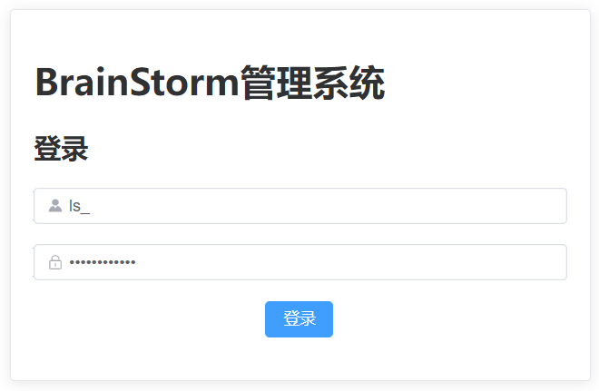
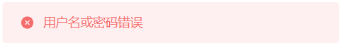
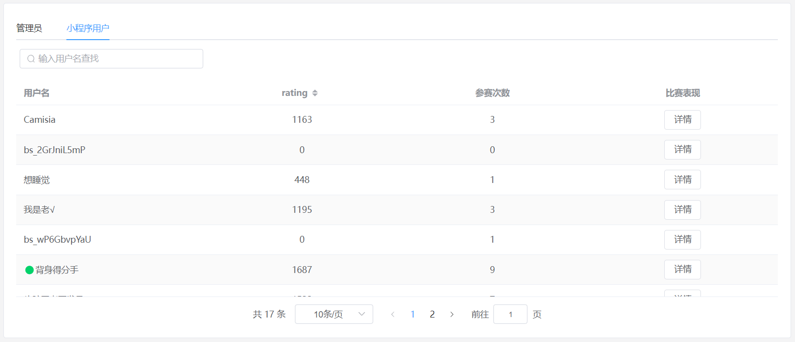
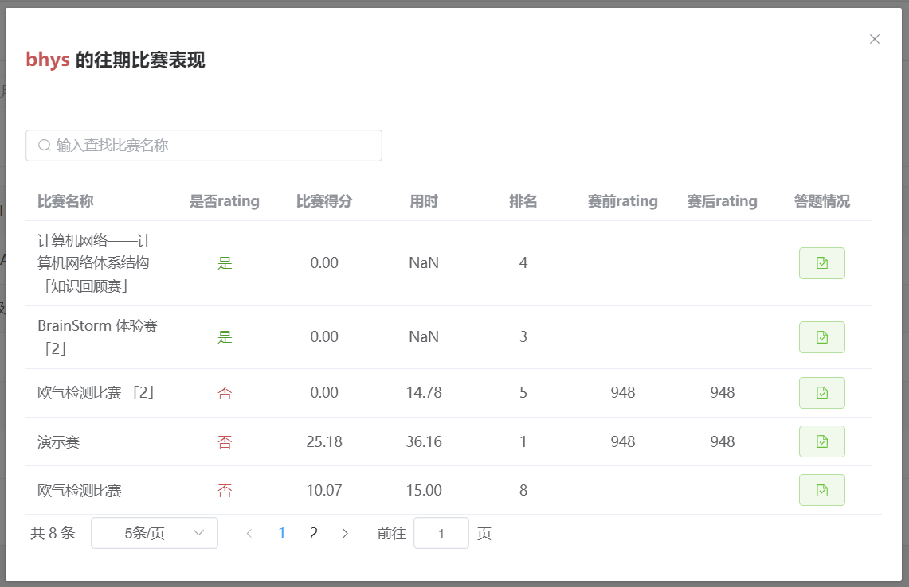
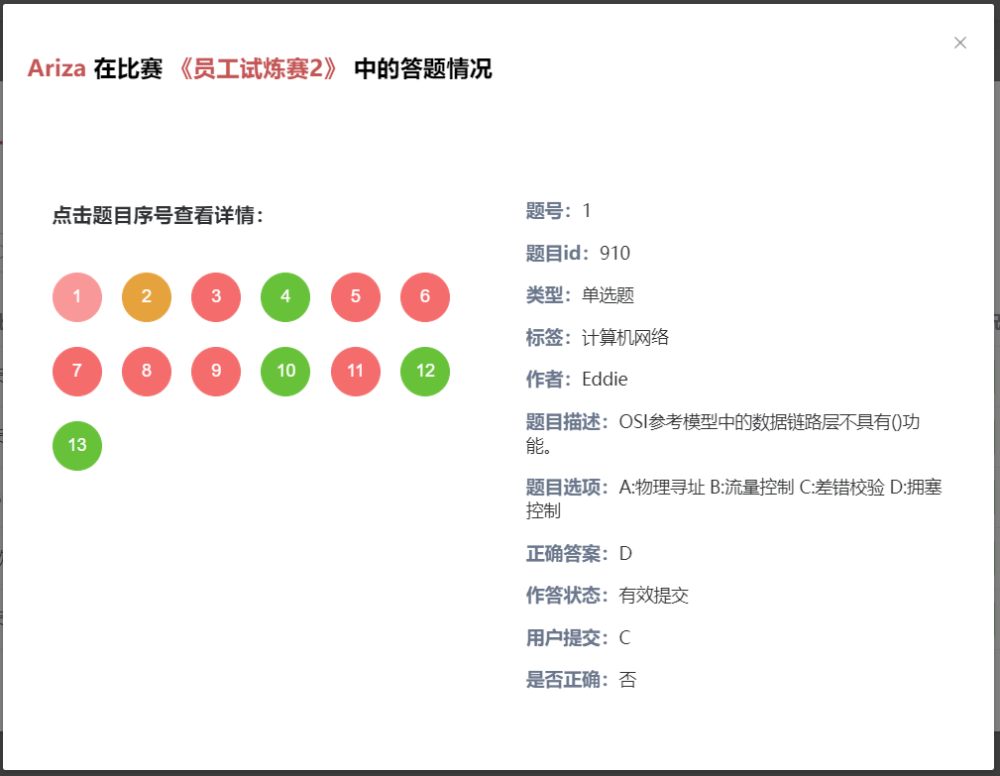

# BrainStorm 知识竞赛系统用户使用手册

## 1 版本历史

| 日期 | 版本 | 人员 | 更新内容 |
| ---- | ---- | ---- | -------- |
| 22.05.14 | v0.0 | 李昀泽 | 创建手册文档及目录;  |
|      |      |      |          |
|      |      |      |          |
|      |      |      |          |

## 2 概述

### 2.1 文档概述

#### 2.1.1 编写目的

根据课程组的总体要求, 和小组的相关讨论, 我们编写本用户使用手册.

本手册为BrainStorm项目团队为团队开发的"BrainStorm知识竞赛系统"编写的用户使用手册.本手册面向的群体为软件工程课程组老师和助教及所有使用本竞赛系统的用户.

编者希望通过该使用手册能够使用户快速了解这个系统的基本情况及使用方法。

#### 2.1.2 项目背景

知识的重要性不言而喻. 人类几千年的历史虽创造出极其丰富的物质基础, 但各种科学/哲学提炼出的知识才是推动发展的核心因素. 无论是出于欣赏或功利, 知识总是被大众广泛喜爱的, 拥有知识的人更是如此. 人们总是喜欢把事物排个名次, 决个高低, 拥有知识的人也不例外.

古代有科举, 现代有考试. 受利于科技发展, 试卷和考场已经不必要了, 一个线上的知识竞赛系统就可以满足相当多的需求. 然而, 虽然当前存在很多公开的知识竞赛软件, 但其包含的题目通常已经被创建者固定, 而难以应用于诸如兴趣社团这样有一定规模但又不具有软件开发能力的中小群体. 因此, 我们计划开发BrainStorm知识竞赛系统, 除知识竞赛的基本功能外, 提供题库管理和比赛创建功能, 来满足上述群体的需要. 

#### 2.1.3 定义

BrainStorm：BrainStorm知识竞赛系统

#### 2.1.4 参考资料

用户使用说明书(示例), 北航软工课程组.

### 2.2 系统概述

#### 2.2.1 目标

BrainStorm的目标是搭建一个知识竞赛系统, 为中小用户群体的题目定制和比赛需求提供支持.

一个目标应用场景是: 学校内有很多社团, 每个社团都可以向本系统添加题目, 开放比赛. 学校里的同学可以自己练习, 以及参加比赛提升rating. rating可以作为学生的某种课外活动量化指标.

#### 2.2.2 功能

```sequence
participant 超级管理员 as spmg
participant 管理员 as mg
participant 题库及后台 as tk
participant 用户 as us
mg->tk: 管理题目
note right of mg: 题库管理功能
spmg->mg: 管理
mg->us: 管理
note right of mg: 用户管理功能
tk->us: 随机抽题练习
note left of us: 自主练习功能
mg->tk: 选题创建比赛并发布
tk->us: 参加比赛
note left of tk: 比赛创建及参与功能
```

#### 2.2.3 性能

## 3 运行环境要求

### 3.1 硬件要求

### 3.2 软件要求

## 4 管理端使用说明

### 4.1 网站访问

管理端网站的地址为http://114.116.218.125/index.html#/

### 4.2 登入

#### 4.2.1 说明

管理员进入系统需同时验证用户名和密码，用户名由超级管理员创建，初始密码为123456。为安全考虑，**建议初次登录系统后立即修改个人密码**。用户名和密码匹配时，将提示登录成功；否则提示用户名或密码错误，且不能进入系统，可以联系超级管理员创建账号或重置密码。

#### 4.2.2 举例



如上图所示，正确填写用户名和密码后，点击登录即可进入系统。当系统提示如下信息时，表示用户名和密码不匹配，原因是没有当前账号或密码错误，可以联系超级管理员创建账号或重置密码。



### 4.3 个人信息修改

### 4.4 用户信息管理

#### 4.4.1 管理员信息管理

#### 4.4.2 小程序用户信息管理

该部分将展示所有使用BrainStorm系统小程序端的用户信息。

##### 4.4.2.1 用户信息

###### 4.4.2.1.1 说明

表格直接展示小程序用户的用户名、rating和参赛次数，可以选择根据rating的升序或降序展示信息，顶部可根据用户名查找用户。

###### 4.4.2.1.2 举例



##### 4.4.2.2 用户比赛表现

###### 4.4.2.2.1 说明

点击小程序用户界面比赛表现列的“详情”按钮，可展示该用户参加过的所有比赛，也可查看比赛是否rating、用户得分、用时、排名、赛前rating和赛后rating的信息。点击用户答题情况可以看到用户在该场比赛中具体的答题情况。

###### 4.4.2.2.2 举例

下图展示用户名为“bhys”的用户的往期比赛表现。



下图为用户答题情况弹窗，左侧展示整体答题情况，绿色代表正确，红色代表错误，黄色为超时，灰色为未提交。点击题号可在右侧查看该题的详细信息，包括题号、题目id、题目类型、题目标签、题目作者、题目描述、题目选项、正确答案、用户作答状态、用户提交和是否正确，其中题目选项字段仅在题目类型为单选题或多选题时显示，用户提交和是否正确字段仅在用户作答状态为有效提交时显示。



### 4.5 题库管理

### 4.6 比赛管理

### 4.7 登出

## 5 用户端使用说明

## 6 附录与其他